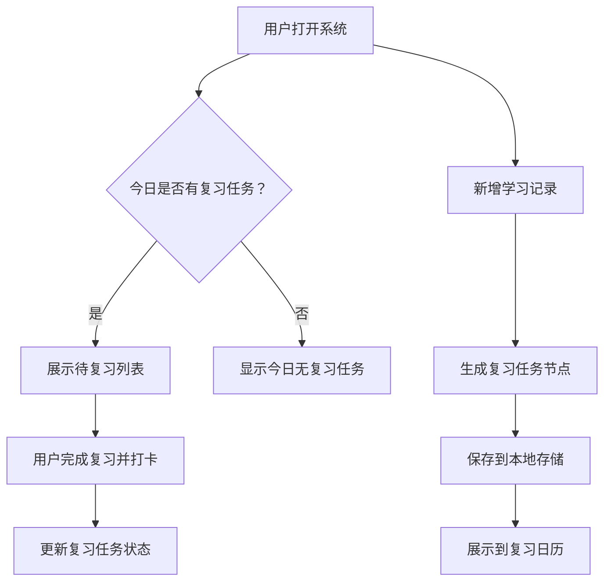

# 艾宾浩斯学习系统 PRD

## 1. 产品概述

艾宾浩斯学习系统是一个基于艾宾浩斯遗忘曲线的个人学习记录与复习提醒工具。用户每天记录学习内容后，系统会自动生成后续复习节点；每日打开页面即可看到当天需要复习的任务，并支持打卡完成、导出备份。系统部署在 GitHub Pages 上，无需后端，便于随时随地通过浏览器访问。

## 2. 核心功能

### 2.1 功能模块

1. **今日看板**：展示当天需要复习的所有内容，支持一键完成打卡。
2. **学习记录**：新增、编辑、删除每日学习内容。
3. **复习日历**：以日历形式查看未来或历史某天的复习任务。
4. **数据备份**：将学习记录和复习状态导出为 JSON 文件，也支持导入恢复。

### 2.2 页面详情

| 页面名称 | 模块名称 | 功能描述 |
|----------|----------|----------|
| 今日看板 | 待复习列表 | 根据当前日期筛选未完成的复习任务，按学习内容分组展示 |
| 今日看板 | 打卡按钮 | 完成某条复习后标记状态为已完成，显示完成时间 |
| 学习记录 | 新增学习 | 输入学习内容、日期、标签，提交后自动生成复习计划 |
| 学习记录 | 记录列表 | 展示所有历史学习记录，支持编辑、删除 |
| 复习日历 | 日历视图 | 按月份查看每一天的复习任务数量，点击可展开详情 |
| 数据备份 | 导出/导入 | 导出 JSON 备份文件；导入 JSON 恢复数据 |

## 3. 核心流程

用户每天打开页面，系统首先计算当天需要复习的任务。用户可以完成复习打卡，也可以切换到学习记录页面新增当天学习的内容。新增学习后，系统根据艾宾浩斯遗忘曲线生成 1、2、4、7、15、30 天的复习任务。用户可随时导出数据到本地，或在更换设备时导入恢复。

## 4. 用户界面设计

### 4.1 设计风格

- **主色调**：深绿色（#1B4332）作为品牌色，象征记忆与成长；米白色（#F8F6F2）作为页面背景，营造纸张质感；琥珀色（#D97706）作为强调色，用于按钮和重点状态。
- **按钮风格**：大圆角（12px）、轻微阴影、hover 时上浮，整体风格温暖、现代。
- **字体**：正文使用系统默认衬线或优雅无衬线字体；标题使用更具人文感的字体（如 Georgia 或系统 serif），强调学习记录工具的“笔记感”。
- **布局风格**：顶部导航 + 单栏卡片布局，信息密度适中，留白充足。
- **图标风格**：使用 lucide-react 线性图标，保持简洁统一。

### 4.2 页面设计概览

| 页面名称 | 模块名称 | UI 元素 |
|----------|----------|---------|
| 今日看板 | 待复习列表 | 卡片式布局、日期徽章、学习内容、标签、完成按钮 |
| 学习记录 | 新增学习 | 表单输入框、日期选择器、标签输入、提交按钮 |
| 学习记录 | 记录列表 | 时间轴式列表、编辑/删除按钮 |
| 复习日历 | 日历视图 | 月份切换、日期格子、任务数量徽章 |

### 4.3 响应式设计

- 桌面优先设计，最大内容宽度 720px，居中显示。
- 移动端自适应：导航变为底部标签栏，卡片全宽，字体和按钮触控区域增大。
- 触控优化：按钮高度不低于 44px，卡片点击区域完整。

