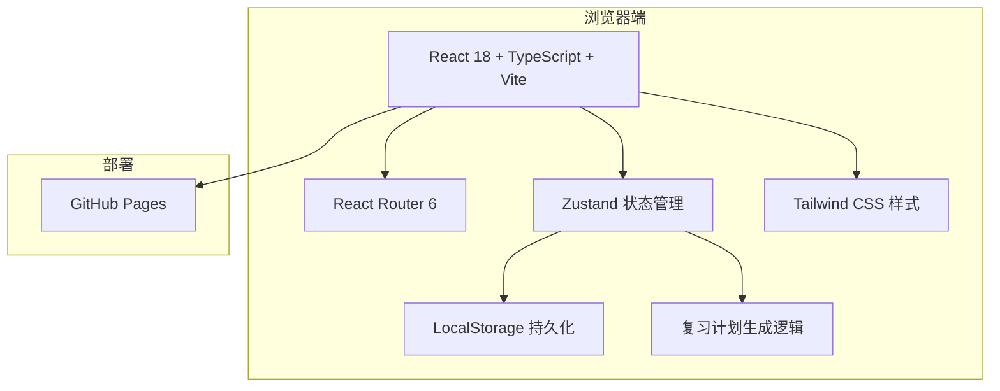
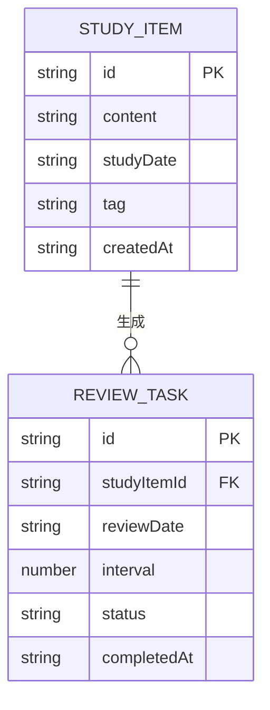

# 艾宾浩斯学习系统 技术架构文档

## 1. 架构设计



## 2. 技术描述

- **前端框架**：React 18 + TypeScript
- **构建工具**：Vite 5
- **路由**：React Router 6
- **状态管理**：Zustand
- **样式方案**：Tailwind CSS 3
- **图标库**：lucide-react
- **本地存储**：LocalStorage（JSON 序列化）
- **部署方式**：GitHub Pages（通过 GitHub Actions 自动构建部署）

## 3. 路由定义

| 路由 | 用途 |
|------|------|
| / | 今日看板，展示当天待复习任务 |
| /records | 学习记录页面，新增/编辑/删除学习记录 |
| /calendar | 复习日历，查看每天复习任务分布 |
| /backup | 数据备份页面，导出/导入 JSON |

## 4. 数据模型

### 4.1 数据模型定义



### 4.2 类型定义

```typescript
interface StudyItem {
  id: string;
  content: string;
  studyDate: string; // YYYY-MM-DD
  tag: string;
  createdAt: string;
}

type ReviewStatus = 'pending' | 'completed' | 'skipped';

interface ReviewTask {
  id: string;
  studyItemId: string;
  reviewDate: string; // YYYY-MM-DD
  interval: number; // 1, 2, 4, 7, 15, 30
  status: ReviewStatus;
  completedAt?: string;
}

interface AppData {
  studyItems: StudyItem[];
  reviewTasks: ReviewTask[];
}
```

## 5. 核心算法

### 5.1 生成复习任务

```typescript
const intervals = [1, 2, 4, 7, 15, 30];

function generateReviewTasks(studyItem: StudyItem): ReviewTask[] {
  return intervals.map((interval) => ({
    id: `${studyItem.id}-${interval}`,
    studyItemId: studyItem.id,
    reviewDate: addDays(studyItem.studyDate, interval),
    interval,
    status: 'pending',
  }));
}
```

### 5.2 查询今日复习任务

```typescript
function getTodayTasks(reviewTasks: ReviewTask[], today: string): ReviewTask[] {
  return reviewTasks.filter(
    (task) => task.reviewDate === today && task.status === 'pending'
  );
}
```

## 6. 目录结构

```
/src
  /components       # 可复用组件
  /pages            # 页面组件
  /hooks            # 自定义 Hooks
  /stores           # Zustand 状态管理
  /utils            # 工具函数（日期、复习计划生成等）
  /types            # 类型定义
  App.tsx           # 根组件
  main.tsx          # 入口
```